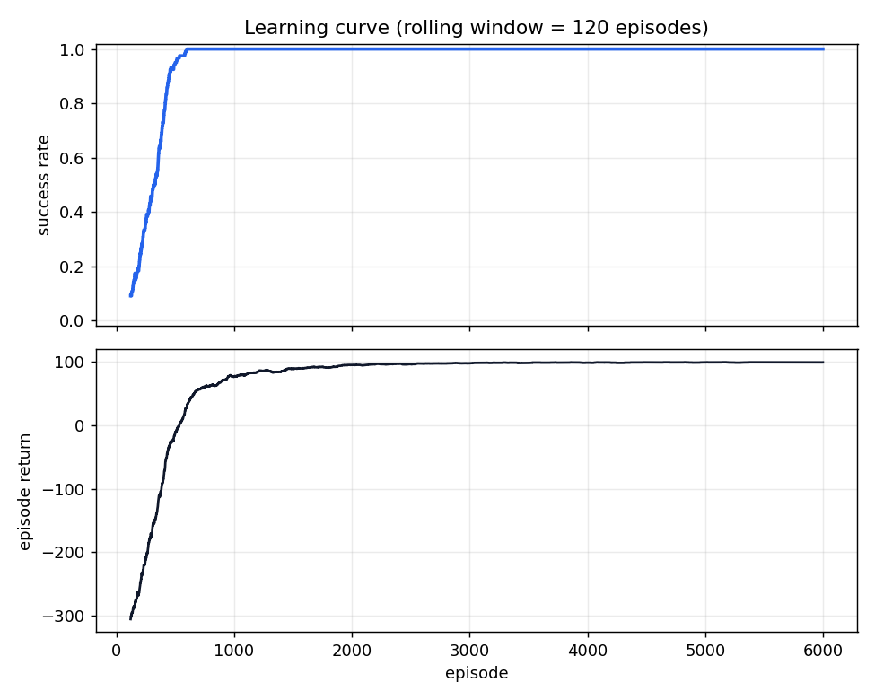
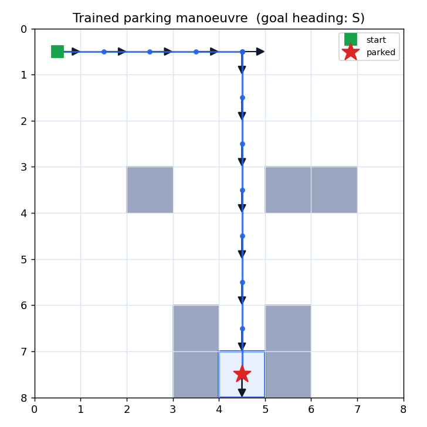

# Mesh Parking RL

A tabular reinforcement-learning agent that learns to park a car on a
mesh-discretised parking lot — plus the write-up that explains *why* the mesh
discretisation and reward shaping make it learnable.

Pure Python: only `numpy` and `matplotlib`. The environment is implemented from
scratch (no gym).

- **Live demo:** https://andreaisabelmontana.github.io/mesh-parking-rl/

## Results (real, reproducible — `python train.py`, seed 0)

| policy            | success rate | mean steps to park |
|-------------------|:------------:|:------------------:|
| **trained agent** |   **100%**   |       **12**       |
| random policy     |      3%      |         —          |

Evaluated over 300 greedy episodes. The agent converges to a reliable park
within ~600 episodes of training; full run is 6000 episodes.




The learned manoeuvre: drive East across the lot, turn South at column 4, then
ease straight down the one-cell corridor between the parked cars into the slot —
arriving with the **correct (South-facing) heading**, which is what counts as
parked.

## The environment (`parking/env.py`)

The lot is a `W × H` **mesh** of cells. The car occupies one cell and carries a
heading discretised to four compass directions. The full state is

```
(col, row, heading)   →   flattened to a single integer for the Q-table
```

Movement is **non-holonomic** — a car cannot slide sideways:

| action        | effect                                   |
|---------------|------------------------------------------|
| `forward`     | move one cell along the current heading  |
| `reverse`     | move one cell opposite the heading       |
| `steer-left`  | rotate heading 90° left (in place)       |
| `steer-right` | rotate heading 90° right (in place)      |

Obstacles (parked cars, pillars, walls) occupy cells. The **goal** is a target
cell *and* a target heading — landing on the slot facing the wrong way is **not**
parked.

### Reward shaping

```
+100   reach the goal cell with the correct heading (aligned)   → episode ends
 −20   collision (drive into a wall, obstacle, or the boundary) → car bounces back
  −1   every step                                               → favour short manoeuvres
  ±    potential-based shaping  F = φ(s′) − φ(s)
```

The shaping potential `φ` rewards getting closer to the goal cell (negative
Manhattan distance) plus a small bonus for heading alignment. It is
**potential-based** (Ng, Harada & Russell, 1999), so it speeds up learning
**without changing which policy is optimal** — it only re-routes credit, never
the destination.

## The agent (`parking/agent.py`)

Tabular **Q-learning**, off-policy:

```
Q(s,a) ← Q(s,a) + α · [ r + γ·maxₐ′ Q(s′,a′) − Q(s,a) ]
```

- `α = 0.2`, `γ = 0.95`
- ε-greedy exploration, ε decays `1.0 → 0.02` (×0.999 per episode)
- random tie-breaking on the argmax (no bias toward action 0)

The Q-table is a dense `(n_states × 4)` array — for the default 8×8 lot that is
just `8·8·4 = 256` states.

## Why it works — the WHY write-up

**1. The mesh turns an intractable problem into a tabular one.**
Parking is continuous: real position, real heading, real geometry. Tabular RL
needs a *countable* state space. Overlaying a mesh and snapping the car to cells
+ four headings collapses the continuous control problem to **256 discrete
states** — small enough that Q-learning can visit every relevant state many
times and fill in an exact value for each. The mesh is the single design choice
that makes the rest possible.

**2. Discretising heading (not just position) is what makes alignment learnable.**
If the state were only `(col, row)`, the agent could never represent "I'm on the
slot but pointing the wrong way." Folding heading into the state — and into the
goal test — is what lets the value function distinguish *parked* from *merely on
the slot*, so the non-holonomic constraint becomes a thing the agent can plan
around instead of a thing it ignores.

**3. Reward shaping fixes the sparse-reward problem without lying to the agent.**
With only a `+100` at the goal, early ε-greedy exploration almost never stumbles
onto the slot (the random policy parks just **3%** of the time), so there is
nothing to bootstrap from and learning stalls. The potential-based shaping term
hands out a small gradient of reward for *every* step toward the goal pose, which
gives Q-learning a signal to climb from the very first episodes. Because the
shaping is a potential difference, it cannot create a shortcut that isn't really
there — the optimal policy is identical to the un-shaped one, it's just reached
far sooner. The learning curve shows the payoff: success climbs from ~10% to
~100% inside the first 600 episodes.

**4. The collision penalty + bounce-back encodes the walls into the value
function.** Rather than forbidding illegal moves, the env lets the agent *try*
to drive into an obstacle, bounces it back, and charges `−20`. Q-learning then
learns to avoid those state-actions on its own — the obstacle layout is absorbed
into the learned values, not hard-coded into the policy.

## Layout

```
parking/
  env.py        mesh parking environment (reset/step, collisions, goal, reward, render)
  agent.py      tabular Q-learning agent (ε-greedy + decay)
  scenario.py   the default 8×8 lot (start, goal, obstacles)
train.py        train, evaluate vs random, save figures + results.json
tests/          pytest suite (env mechanics + learning result)
figures/        learning_curve.png, trajectory.png, trajectory.txt
results.json    real metrics from the last training run
```

## Run it

```bash
pip install -r requirements.txt

python train.py            # train, save figures/ and results.json
python -m pytest -q        # run the test suite
```

`train.py` flags: `--episodes N` `--seed S` `--eval-episodes N` `--quiet`.

## Tests

The suite covers env mechanics — collision detection, goal detection *with*
alignment, boundary bounce-back, reward signs, the kinematics of each action,
and consistent/bijective state discretisation — plus the headline learning
result: **a trained agent parks far more often than a random policy** (≥95% vs
≤30%, a ≥0.5 gap), training converges, and the greedy rollout reaches the slot.

```
$ python -m pytest -q
............................                                             [100%]
28 passed
```
